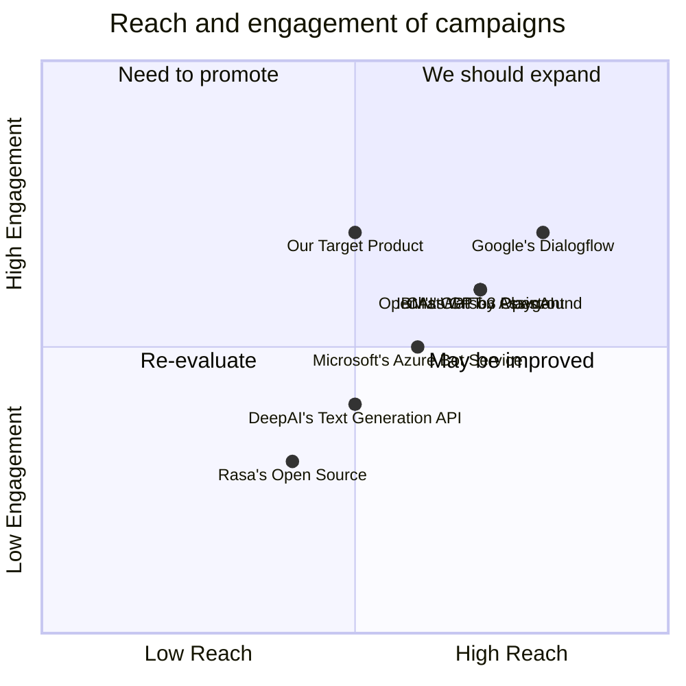

## Original Requirements
The boss has instructed to create a gradio app for huggingface for metaGPT with a seamless GUI, prioritizing the user experience.

## Product Goals
```python
[
    "Create a gradio app that integrates seamlessly with HuggingFace's metaGPT",
    "Ensure the GUI is intuitive and user-friendly",
    "Prioritize user experience in all aspects of the product"
]
```

## User Stories
```python
[
    "As a user, I want to easily navigate through the app so that I can use it efficiently",
    "As a user, I want the app to integrate seamlessly with HuggingFace's metaGPT so that I can use the features without any issues",
    "As a user, I want the GUI to be intuitive so that I can understand how to use the app without needing extensive guidance",
    "As a user, I want the app to prioritize user experience so that I can enjoy using the product",
    "As a user, I want the app to be reliable and efficient so that I can trust its performance"
]
```

## Competitive Analysis
```python
[
    "OpenAI's GPT-3 Playground: Provides a similar service but lacks a dedicated GUI",
    "DeepAI's Text Generation API: Offers text generation but lacks the integration with HuggingFace's metaGPT",
    "Google's Dialogflow: Offers a comprehensive suite of tools but may be overwhelming for users looking for a simple GUI",
    "Microsoft's Azure Bot Service: Provides a platform for developing bots but lacks the specific integration with HuggingFace's metaGPT",
    "IBM's Watson Assistant: Offers a robust platform for developing AI assistants but may not prioritize user experience in the same way",
    "Rasa's Open Source: Provides a platform for developing AI assistants but lacks the seamless GUI",
    "ChatGPT by OpenAI: Offers a similar service but lacks the integration with HuggingFace's metaGPT"
]
```

## Competitive Quadrant Chart


## Requirement Analysis
The product should be a gradio app that integrates with HuggingFace's metaGPT. The GUI should be intuitive and user-friendly, and the user experience should be prioritized in all aspects of the product.

## Requirement Pool
```python
[
    ("Integration with HuggingFace's metaGPT", "P0"),
    ("Intuitive and user-friendly GUI", "P0"),
    ("Prioritization of user experience", "P0"),
    ("Reliability and efficiency of the app", "P1"),
    ("Easy navigation through the app", "P1")
]
```

## UI Design draft
The app should have a clean and minimalist design, with clear navigation options. The main screen should display the input field for the user to interact with the metaGPT. There should be clear instructions on how to use the app, and the results should be displayed in an easy-to-read format. The color scheme should be pleasing to the eye and not distracting.

## Anything UNCLEAR
There are no unclear points.