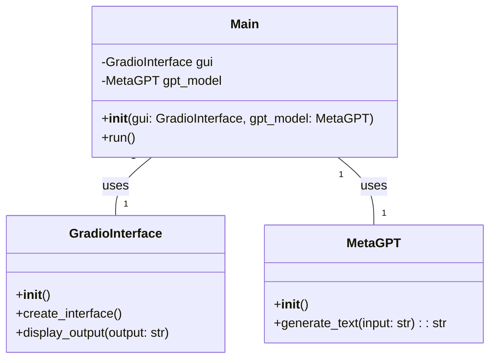
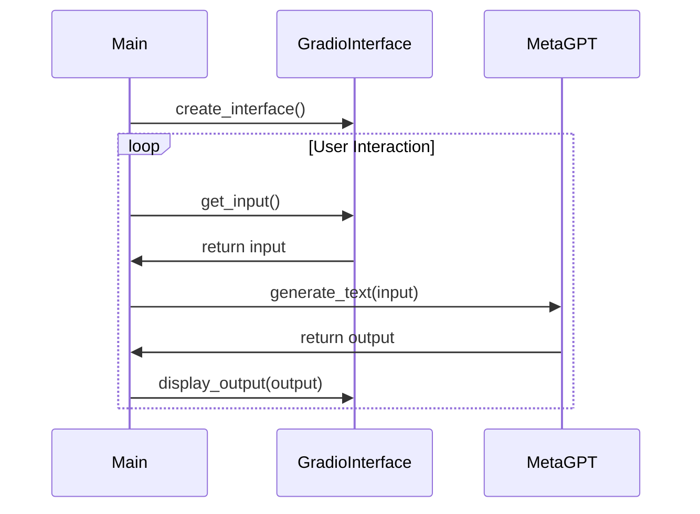

## Implementation approach
The main challenge of this project is to integrate HuggingFace's metaGPT with Gradio to create a user-friendly GUI. We will use the transformers library from HuggingFace for the metaGPT model and Gradio for creating the GUI. The app will take user input, process it through the metaGPT model, and display the output in the GUI. We will also need to handle exceptions and errors to ensure the app is reliable and efficient.

## Python package name
```python
"gradio_meta_gpt"
```

## File list
```python
[
    "main.py",
    "gpt_model.py",
    "gui.py",
    "utils.py"
]
```

## Data structures and interface definitions


## Program call flow


## Anything UNCLEAR
The requirement is clear to me.